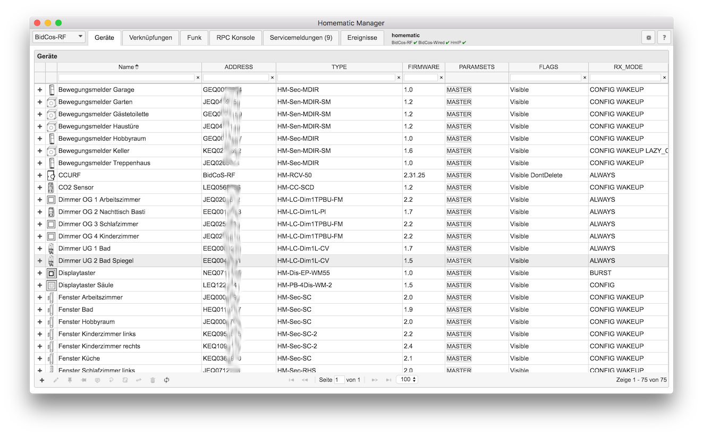
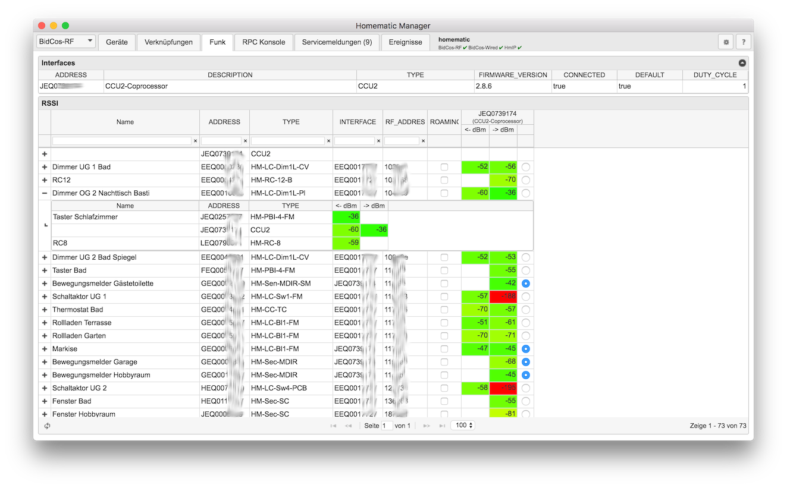
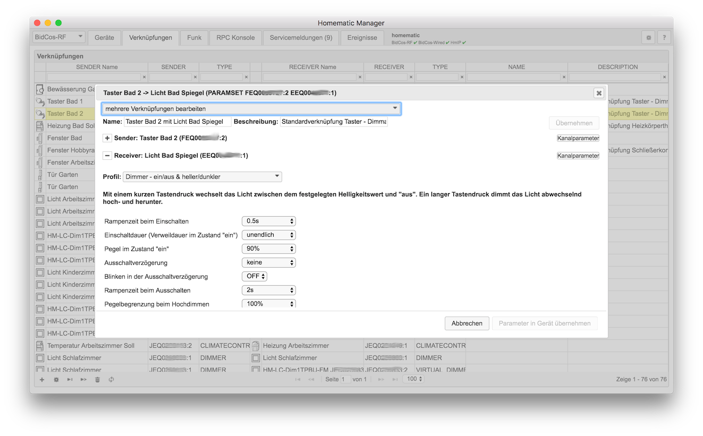

# Homematic Manager

Der Homematic Manager ist ein Konfigurationswerkzeug für [HomeMatic](http://www.homematic.com)-Schnittstellenprozesse
(rfd, hs485d, hmipserver/crRFD und [Homegear](http://www.homegear.eu)).

Mit dem Homematic Manager ist es möglich Geräte an- und abzulernen, Geräte-Konfigurationen und Direktverknüpfungen zu
verwalten und vieles mehr.

Unter [latest releases](https://github.com/hobbyquaker/homematic-manager/releases/latest) sind Downloads für macOS, 
Linux und Windows zu finden.

## Lizenz

Copyright (c) 2014-2018 Sebastian "Hobbyquaker" Raff, André "Anli" Litfin

[GPLv3](https://www.gnu.org/licenses/gpl-3.0.html)

Der obige Urheberrechtsvermerk ist in allen Kopien oder Teilkopien der Software beizulegen.

DIE SOFTWARE WIRD OHNE JEDE AUSDRÜCKLICHE ODER IMPLIZIERTE GARANTIE BEREITGESTELLT, EINSCHLIESSLICH DER GARANTIE ZUR BENUTZUNG FÜR DEN VORGESEHENEN ODER EINEM BESTIMMTEN ZWECK SOWIE JEGLICHER RECHTSVERLETZUNG, JEDOCH NICHT DARAUF BESCHRÄNKT. IN KEINEM FALL SIND DIE AUTOREN ODER COPYRIGHTINHABER FÜR JEGLICHEN SCHADEN ODER SONSTIGE ANSPRÜCHE HAFTBAR ZU MACHEN, OB INFOLGE DER ERFÜLLUNG EINES VERTRAGES, EINES DELIKTES ODER ANDERS IM ZUSAMMENHANG MIT DER SOFTWARE ODER SONSTIGER VERWENDUNG DER SOFTWARE ENTSTANDEN.

HomeMatic und BidCoS sind eingetragene Warenzeichen der [eQ-3 AG](http://eq-3.de)
