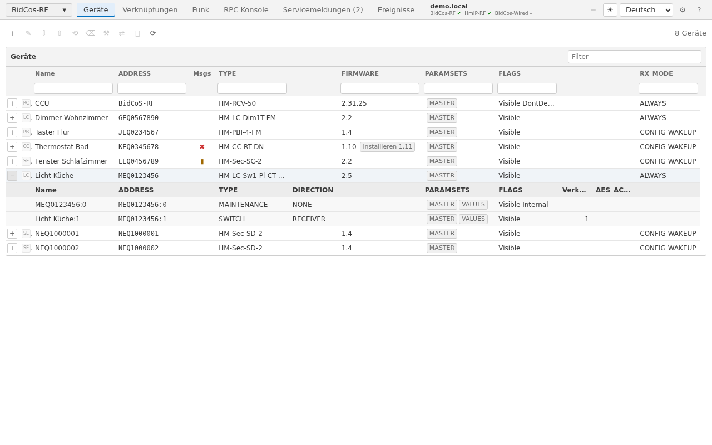
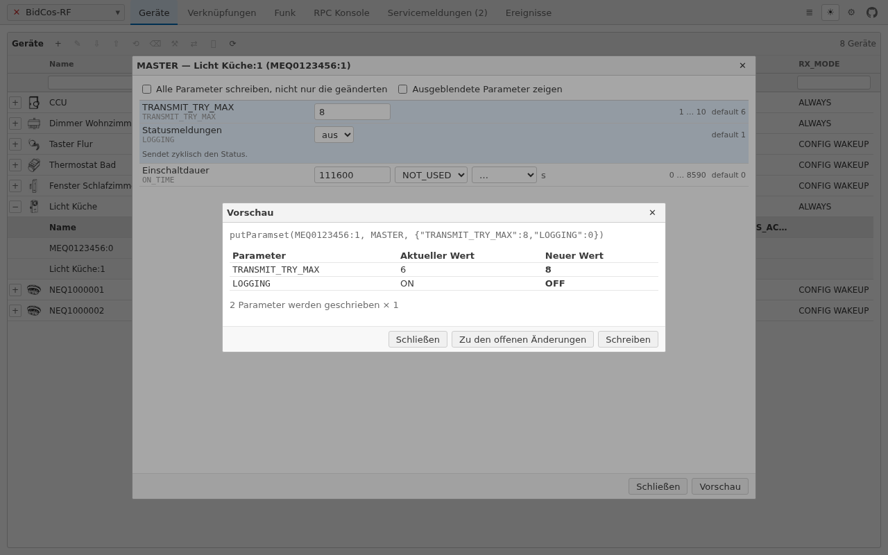
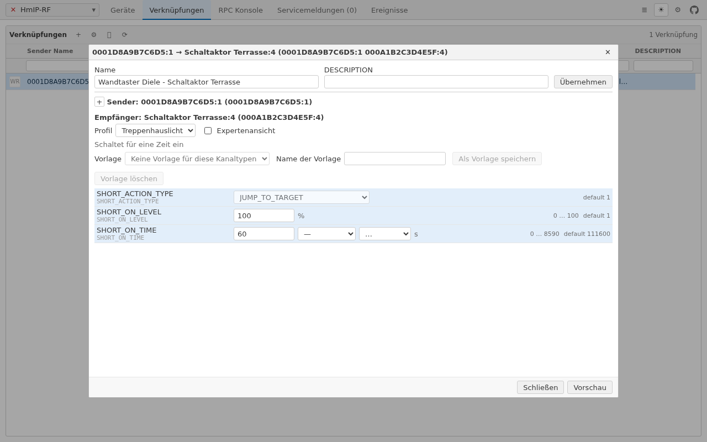

# Homematic Manager

Konfiguration und Administration von [Homematic](http://www.homematic.com)- und HomematicIP-Geräten:
Geräte an- und ablernen, Geräte- und Kanalkonfiguration (Paramsets) bearbeiten, Direktverknüpfungen
anlegen und pflegen, Empfangsqualität (RSSI) beurteilen, Servicemeldungen quittieren, Events
mitlesen und beliebige RPC-Methoden von Hand aufrufen.

Eine ausführliche Beschreibung der 2.x-Oberfläche steht im
[Homematic-Forum](https://homematic-forum.de/forum/viewtopic.php?f=18&t=45134).

 

> **Stand dieser Datei: Version 3.0 ist in Entwicklung.**
> Das letzte veröffentlichte Release ist **2.7.1** (2023-01-28), eine reine Electron-App. Version
> 3.0 ist ein Neubau auf aktuellem Electron, Svelte 5 und einem getesteten TypeScript-Kern und
> läuft zusätzlich als Server und als CCU-Addon. Die Entwicklung findet auf dem Branch `3.0-dev`
> statt (Version `3.0.0-dev.0`), der 2.7.1-Stand liegt unverändert unter `legacy/`.
> **Für 3.0 gibt es noch kein Release**: die vier Release-Workflows sind gebaut, aber noch nie
> gelaufen. Die Downloads und Kommandos unten beschreiben, was 3.0 ausliefert; verfügbar sind sie
> erst mit dem ersten Tag. Der Plan dazu: [ROADMAP.md](ROADMAP.md).

_Die Screenshots zeigen 2.7. Der Aufbau bleibt in 3.0 gleich — gleiche Tabs, gleiche Tabellen,
gleiche Dialoge, nur neu implementiert (D-3). Aktuelle Screenshots kommen mit dem Beta-Zyklus._

## Installation

Alle Installationsarten führen **dasselbe Backend und dieselbe Oberfläche** aus und benutzen
**dasselbe Konfigurationsformat**, eine `config.json`. Ein Wechsel zwischen ihnen ist deshalb ein
Kopiervorgang — siehe [docs/moving-between-installs.md](docs/moving-between-installs.md).

| Installationsart | Hardware / Betriebssystem | Kommando oder Download | Konfiguration liegt in |
| --- | --- | --- | --- |
| **CCU-Addon** ([Anleitung](docs/install-addon.md)) | CCU3, ELV-Charly, OpenCCU — `armv7l`, `aarch64`, `x86_64` | `hmm-ccu-<arch>-<version>.tar.gz` aus dem [Release](https://github.com/hobbyquaker/homematic-manager/releases/latest), hochgeladen unter _Systemsteuerung → Zusatzsoftware_ | `/usr/local/hmm/config.json` |
| **Desktop-App** ([Anleitung](docs/install-electron.md)) | Windows 10+ (x64, arm64), macOS 12+ (universal), Linux glibc 2.31+ (x64, arm64) | Installer bzw. AppImage/deb/dmg aus dem [Release](https://github.com/hobbyquaker/homematic-manager/releases/latest) | `%APPDATA%\Homematic Manager\config.json`, `~/Library/Application Support/Homematic Manager/config.json`, `~/.config/Homematic Manager/config.json` |
| **Server im LXC** ([Anleitung](docs/install-lxc.md)) — die empfohlene Serverinstallation | Proxmox-Container, Debian 12/13, oder jeder Linux-Host mit Node ≥ 22.12 | `npm install -g <paketname>` + `homematic-manager-web --install` | `/var/lib/homematic-manager/config.json`, Dienstoptionen in `/etc/homematic-manager/config.env` |
| **Docker** ([Anleitung](docs/install-docker.md)) | `linux/amd64`, `linux/arm64`, `linux/arm/v7` | `docker run … ghcr.io/hobbyquaker/homematic-manager:latest` | `/data/config.json` im Volume |

**Offen (OQ-14): der npm-Paketname steht noch nicht fest.** Im Repository heißt das Paket heute
`@homematic-manager/web`; die Empfehlung der Roadmap ist, den 2.x-Namen `homematic-manager` auf npm
weiterzuverwenden, weil dessen `npm i -g`-Publikum ohnehin eine Serverinstallation wollte. Entschieden
wird das vor dem ersten Alpha-Tag; bis dahin ist der Name in allen Anleitungen als
`<paketname>` bzw. `@homematic-manager/web` markiert.

**Nicht mehr dabei:** 32-Bit-ARM-Desktop-Builds (`linux-armv7l`). Electron 44 veröffentlicht dafür
kein Binary mehr (#115, #139). Auf solchen Maschinen laufen das CCU-Addon und das npm-Paket, beides
reines Node.

### Was in welcher Situation passt

- **Nur eine CCU und kein Server?** Das CCU-Addon. Es läuft auf der Zentrale selbst, ist über die
  Systemsteuerung erreichbar, braucht keine Firewall-Regel und keine Konfiguration.
- **Ein Arbeitsplatzrechner?** Die Desktop-App. Sie ist die direkte Nachfolgerin von 2.x.
- **Ein Server im Haus?** Ein Proxmox-LXC mit dem npm-Paket. Der Container hat eine eigene Adresse
  im LAN, damit erreicht die CCU den Callback ohne NAT und ohne Portfreigabe.
- **Docker** geht auch, ist aber wegen des Callbacks der fummeligste Weg — die Seite dazu sagt,
  worauf zu achten ist.

## Funktionsübersicht

Sechs Tabs, dieselben wie in 2.7 (die englischen Bezeichnungen in Klammern):

| Tab | Was darin geht |
| --- | --- |
| **Geräte** (Devices) | Geräteliste mit aufklappbarer Kanalliste, Gerätebildern, dekodierten Flags, RX-Mode und Firmware-Spalte mit Update-Knopf. Kontextmenü: umbenennen (Gerät, `:0`, optional alle Kanäle), löschen, ersetzen, Konfiguration reparieren, `reportValueUsage` über eine ganze Auswahl, Paramset-Editoren |
| **Verknüpfungen** (Links) | Direktverknüpfungen als Tabelle mit beiden Gerätebildern, Anlegen über die Rollenmatrix, Löschen mehrerer Verknüpfungen auf einmal, `setLinkInfo`, kurz/lang auslösen (nur BidCos-RF), und der Verknüpfungs-Editor mit den Easy-Mode-Profilen und einer Expertenansicht |
| **Funk** (RSSI) | Gateway-Liste mit Sende-/Empfangswerten je Gegenstelle, die HmIP-Matrix aus `RSSI_DEVICE`/`RSSI_PEER`, „am besten gehört von“ und `setBidcosInterface` |
| **Servicemeldungen** (Service messages) | Liste mit Einzel- und Sammelquittierung (quittierbar sind nur `STICKY_UNREACH` und `SABOTAGE`), Toasts statt modaler Fenster, abschaltbar („leiser Modus“) |
| **Events** | Live-Mitschnitt der XML-RPC-Events mit zwei Filterfeldern, Pause und Zähler je Gerät |
| **RPC-Konsole** (RPC console) | 51 RPC-Methoden mit generiertem Argumentformular — Struct-Zeilen für ein Paramset, Bitfeld-Ankreuzfelder, Auswahllisten, die Adressen der Schnittstelle als Datalist — der exakte Aufruf über dem Formular, ein Verlauf und die rohe Antwort samt Faults |

Dazu, quer über die Tabs:

- **Paramset-Editor** für MASTER, VALUES und LINK. Er schreibt **nur geänderte, validierte
  Parameter** und zeigt vor jedem Schreiben eine Vorschau des exakten `putParamset`-Aufrufs. Nach
  jedem Schreiben wird zurückgelesen, weil `rfd` auch dann `ok` antwortet, wenn es einen Wert
  stillschweigend verworfen oder auf `MAX` begrenzt hat. Mehrfachanwendung geht nur auf Kanäle mit
  _identischer_ Paramset-Beschreibung; alles andere wird mit Begründung gesperrt. Hintergrund und
  Messungen: [docs/config-pending.md](docs/config-pending.md).
- **Gerätespezifische Editoren** über dem generischen Formular: Heizungs-Wochenprogramm,
  HmIP-Schaltprogramm, Rollladen- und Jalousie-Kalibrierung in Sekunden, Dauer-Auswahl für alle
  Basis/Faktor- und HmIP-Einheit/Wert-Paare, und Klartext für Aufzählungswerte, die die
  Beschreibung nur als Zahl kennt. Ein Häkchen zeigt zusätzlich die Rohparameter.
- **Gerät anlernen**: BidCos-Anlernmodus mit Seriennummer und temporärem Schlüssel, `searchDevices`
  für BidCos-Wired, HmIP mit SGTIN und Schlüssel oder Schlüsselserver, QR-Scanner, und direkt nach
  dem Anlernen ein Namensfeld.
- **Konfiguration**: CCU-Adresse mit Suche im Netz (UDP-Discovery), TLS, Authentifizierung, ReGa an
  oder aus, Callback-Adresse und -Ports, Sprache (Deutsch/Englisch), Schreibpause, RPC-Log-Ordner
  und selbstdefinierte Schnittstellen (Host, Port, Protokoll, Pfad).
- **Helles und dunkles Design**, das der Systemeinstellung folgt, mit einem Schalter, der gemerkt
  wird.

### Was 3.0 anders macht als 2.7

Ausführlich in [CHANGELOG.md](CHANGELOG.md) und [docs/migration-from-2.x.md](docs/migration-from-2.x.md);
das Wichtigste in drei Zeilen:

- Der Paramset-Editor schreibt nur noch geänderte Werte. Das ist die Ursache von #98 — 2.x schickte
  bei „auf mehrere Kanäle anwenden“ ganze Paramsets an Kanäle mit anderer Beschreibung und hat sie
  damit dauerhaft unbrauchbar gemacht.
- **ReGa ist optional** (D-2): ohne die Logikschicht arbeitet die App vollständig weiter und
  benutzt lokal gespeicherte Namen.
- Außerhalb der CCU wird ausschließlich **XML-RPC** gesprochen (D-28). BIN-RPC gibt es auf einer CCU
  nur auf dem Loopback; die öffentlichen Ports 2001/2000 sind lighttpd-XML-RPC-Proxys.

## Dokumentation

| Seite | Inhalt |
| --- | --- |
| [docs/README.md](docs/README.md) | Übersicht über alle Seiten |
| [docs/install-addon.md](docs/install-addon.md) | CCU-Addon: Pakete je Architektur, Installation, Token, Update, Fehlersuche |
| [docs/install-electron.md](docs/install-electron.md) | Desktop-App: Download je Betriebssystem, Signatur, Updates, Profilverzeichnisse |
| [docs/install-lxc.md](docs/install-lxc.md) | Proxmox-LXC mit dem npm-Paket — die empfohlene Serverinstallation |
| [docs/install-docker.md](docs/install-docker.md) | Docker-Image, und was der Callback dabei bedeutet |
| [docs/moving-between-installs.md](docs/moving-between-installs.md) | Von einer Installationsart in eine andere umziehen |
| [docs/migration-from-2.x.md](docs/migration-from-2.x.md) | Umstieg von 2.x: wo die alte Konfiguration liegt, was sich verhält wie vorher und was nicht |
| [docs/config-pending.md](docs/config-pending.md) | Die Laborstudie zu `CONFIG_PENDING` und dem Schreibpfad |
| [BUILD.md](BUILD.md) | Selbst bauen, Monorepo-Aufbau, Tests, Release-Workflows |
| [ROADMAP.md](ROADMAP.md) | Der Plan für 3.0, alle Entscheidungen D-1..D-30 und die offenen Fragen |
| [docs/analysis-2026-09.md](docs/analysis-2026-09.md) | Die Analyse, auf der der Plan aufsetzt |

Reverse-Proxy-Beispiele für die Serverinstallationen:
[lighttpd](docs/lighttpd-homematic-manager.conf), [nginx](docs/nginx-homematic-manager.conf),
[Caddy](docs/Caddyfile-homematic-manager).

## Mitmachen

Fehler und Wünsche bitte in die
[Issues](https://github.com/hobbyquaker/homematic-manager/issues). Wer selbst bauen oder etwas
beitragen will, findet den Einstieg in [BUILD.md](BUILD.md): Monorepo mit npm-Workspaces, `npm ci`,
`npm test`, und je ein Workflow für jede der vier Auslieferungen.

## Lizenz

Copyright (c) 2014-2026 Sebastian "Hobbyquaker" Raff, André "Anli" Litfin

Der 3.0-Code steht unter [AGPL-3.0-or-later](https://www.gnu.org/licenses/agpl-3.0.html), siehe
[LICENSE](LICENSE). Bis einschließlich 2.7.1 war das Projekt GPL-3.0.

- Die 2.x-Quellen unter [`legacy/`](legacy/) bleiben **GPL-3.0-or-later** — sie enthalten Beiträge
  von anli-ger, Stefan Simroth, Homoran, Sathya Laufer und anderen. GPLv3 Abschnitt 13 erlaubt die
  Kombination mit einem AGPL-Werk; nichts aus `legacy/` wandert ungeprüft in die neuen Pakete
  (D-26).
- Portierter MIT-Code aus eigenen Repositories des Autors (`cast.js` aus node-red-contrib-ccu, der
  Installer aus mqtt-interfaces-core) behält seine Nennung im Dateikopf.
- Die Gerätedaten unter [`data/dist/`](data/) sind **kein** Teil des AGPL-Programms: sie sind aus
  [openccu-data](https://github.com/SukramJ/openccu-data) abgeleitete eQ-3-Daten und stehen unter
  der **Homematic Software License 2.0** — frei für private und nicht-kommerzielle Nutzung,
  kommerzielle Weitergabe braucht die Erlaubnis von eQ-3. Die Einzelheiten stehen in
  [data/NOTICE.md](data/NOTICE.md).

DIE SOFTWARE WIRD OHNE JEDE AUSDRÜCKLICHE ODER IMPLIZIERTE GARANTIE BEREITGESTELLT, EINSCHLIESSLICH
DER GARANTIE ZUR BENUTZUNG FÜR DEN VORGESEHENEN ODER EINEM BESTIMMTEN ZWECK SOWIE JEGLICHER
RECHTSVERLETZUNG, JEDOCH NICHT DARAUF BESCHRÄNKT. IN KEINEM FALL SIND DIE AUTOREN ODER
COPYRIGHTINHABER FÜR JEGLICHEN SCHADEN ODER SONSTIGE ANSPRÜCHE HAFTBAR ZU MACHEN, OB INFOLGE DER
ERFÜLLUNG EINES VERTRAGES, EINES DELIKTES ODER ANDERS IM ZUSAMMENHANG MIT DER SOFTWARE ODER
SONSTIGER VERWENDUNG DER SOFTWARE ENTSTANDEN.

"Homematic", "HomematicIP" und "BidCoS" sind eingetragene Warenzeichen der
[eQ-3 AG](http://eq-3.de). Dieses Projekt steht in keiner Verbindung zu eQ-3.

---

## English

**Homematic Manager** configures and administers [Homematic](http://www.homematic.com) and
HomematicIP devices: pair and unpair devices, edit device and channel configuration (paramsets),
create and maintain direct links, judge radio quality (RSSI), acknowledge service messages, watch
the live event stream and call any RPC method by hand. The user interface is German and English.

**Version 3.0 is under development and not released yet.** 2.7.1 (2023-01-28) is the last published
release and is a desktop app only; 3.0 is a rebuild on current Electron, Svelte 5 and a tested
TypeScript core that additionally runs as a server and as a CCU addon. Work happens on the `3.0-dev`
branch at `3.0.0-dev.0`; the 2.7.1 sources sit unchanged under `legacy/`. The release workflows
exist but have never run, so nothing of 3.0 is downloadable yet. The plan is [ROADMAP.md](ROADMAP.md).

Every install type runs the same backend and the same UI and shares one configuration format, so
moving between them is a copy (D-25):

| Install type | Hardware / OS | Command or download | Configuration lives in |
| --- | --- | --- | --- |
| [CCU addon](docs/install-addon.md) | CCU3, ELV-Charly, OpenCCU — `armv7l`, `aarch64`, `x86_64` | `hmm-ccu-<arch>-<version>.tar.gz`, uploaded in _Systemsteuerung → Zusatzsoftware_ | `/usr/local/hmm/config.json` |
| [Desktop app](docs/install-electron.md) | Windows 10+, macOS 12+, Linux glibc 2.31+ | installer / AppImage / deb / dmg from the release | `%APPDATA%\Homematic Manager`, `~/Library/Application Support/Homematic Manager`, `~/.config/Homematic Manager` |
| [Server in an LXC](docs/install-lxc.md) (recommended) | Proxmox / Debian 12+ / any Linux with Node ≥ 22.12 | `npm install -g <package>` then `homematic-manager-web --install` | `/var/lib/homematic-manager/config.json` |
| [Docker](docs/install-docker.md) | `amd64`, `arm64`, `arm/v7` | `docker run … ghcr.io/hobbyquaker/homematic-manager:latest` | `/data/config.json` |

The **npm package name is still open (OQ-14)**: the workspace calls it `@homematic-manager/web`
today and the roadmap recommends reusing the 2.x name `homematic-manager`. It is decided before the
first alpha tag.

Documentation: [docs/README.md](docs/README.md) is the index;
[docs/migration-from-2.x.md](docs/migration-from-2.x.md) is what a 2.x user should read first;
[BUILD.md](BUILD.md) is how to build it; [CHANGELOG.md](CHANGELOG.md) lists what changed.

Licence: **AGPL-3.0-or-later** for the 3.0 code ([LICENSE](LICENSE)), **GPL-3.0-or-later** for the
2.x sources under [`legacy/`](legacy/) with their contributors, and the eQ-3 device data under
[`data/dist/`](data/) stays under the **Homematic Software License 2.0** — see
[data/NOTICE.md](data/NOTICE.md).
